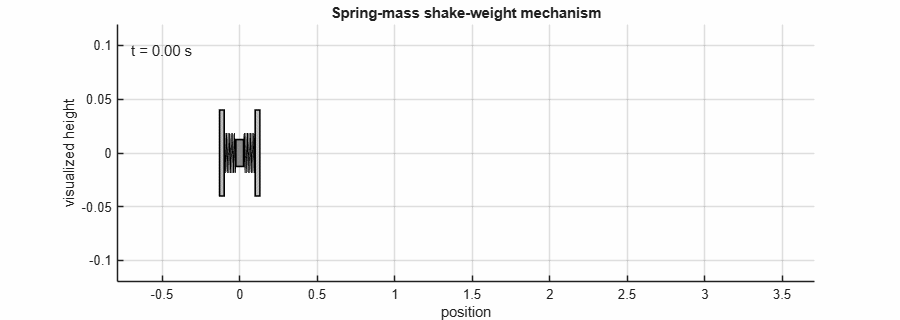

# Dynamic Simulation of a Spring-Mass Shake-Weight Mechanism in Simulink

This repository contains a MATLAB/Simulink model of a simplified shake-weight/dumbbell mechanism. The model represents two side masses and a center bar connected through spring-like elements, with switching logic for force direction and contact constraints.

The repository demonstrates physical system modeling in Simulink: parameter definition, force-balance logic, state integration, conditional switching, contact handling, and basic motion visualization.





### Legacy VR visualization note

The original Simulink model contains a legacy `VR Sink` block from Simulink 3D Animation. Recent MATLAB releases no longer support the old viewer, and the original `.WRL` virtual-world file is not included in this repository. The numerical simulation does not require this block, so `scripts/run_simulation.m` automatically comments out legacy VR/3D visualization blocks before running the model.


## Visualization

The original model contains a legacy `VR Sink` block that depends on a `.WRL` virtual-world file. Recent MATLAB releases no longer support the old viewer reliably, so the default repository workflow uses MATLAB figure-based animation instead.

Run:

```matlab
addpath(genpath(pwd))
run('scripts/run_visual_simulation.m')
```

This creates:

```text
media/shake_weight_animation.gif
```

The GIF reconstructs the mechanism from the model outputs: left mass position, center bar position, and right mass position.

## Repository structure

```text
.
├── model/
│   └── RenanArdaCarlak_ShakeWeightDumbbell.slx
├── scripts/
│   ├── init_parameters.m
│   ├── model_parameters.m
│   └── run_simulation.m
│   └── run_visual_simulation.m
│   └── configure_animation_logging.m
│   └── animate_shake_weight.m
│   └── disable_legacy_vr_blocks.m
│   └── extract_position_output.m
├── tests/
│   └── smoke_test.m
├── docs/
│   ├── MODEL_OVERVIEW.md
│   ├── REPRODUCIBILITY.md
│   └── VISUALIZATION.md
├── media/
│   └── model_thumbnail.png
│   └── shake_weight_animation.gif
├── results/
│   └── .gitkeep
├── CITATION.cff
├── LICENSE
└── README.md
```

## Model summary

The model includes:

- three translational bodies: left mass, center bar, and right mass;
- spring-force contributions from the left and right sides;
- direction-dependent force switching based on the applied excitation;
- contact/overlap prevention logic between the bar and side masses;
- acceleration, velocity, and position integration for body motion;
- optional VR-style visualization blocks, depending on local Simulink installation support.
- MATLAB-based 2D animation as a GIF

## Requirements

- MATLAB
- Simulink
- Optional: Simulink 3D Animation / VR block support if the visualization section is used

The helper scripts use base MATLAB/Simulink functionality. The model itself may require local block-library support depending on MATLAB release and installed Simulink products.

## How to run

From the repository root in MATLAB:

```matlab
addpath(genpath(pwd));
run('scripts/run_simulation.m')

% Run simulation and export a GIF animation
run('scripts/run_visual_simulation.m');
```

For a basic load and configuration check:

```matlab
addpath(genpath(pwd));
run('tests/smoke_test.m');
```

## Parameters

Default parameters are defined in `scripts/model_parameters.m` and exported to the MATLAB base workspace by `scripts/init_parameters.m` for compatibility with the original Simulink model.

| Parameter | Default value | Description |
|---|---:|---|
| `amplitude` | `-0.001` | Signal-generator amplitude |
| `frequency` | `0.32` | Signal-generator frequency |
| `m1` | `1.0` | Left-side mass parameter |
| `m2` | `0.5` | Center-bar mass parameter |
| `m3` | `1.0` | Right-side mass parameter |
| `LeftThickness` | `0.03` | Left mass thickness |
| `RightThickness` | `0.03` | Right mass thickness |
| `BarThickness` | `0.05` | Center-bar thickness |
| `LeftLength` | `0.10` | Undeformed left spring length |
| `RightLength` | `0.10` | Undeformed right spring length |
| `LeftSpringConstant` | `1.0` | Left spring stiffness |
| `RightSpringConstant` | `1.0` | Right spring stiffness |

## Scope

This is a compact educational/mechanical simulation model, not a validated product model. Numerical behavior can depend on solver settings, MATLAB release, and visualization-block availability.

## License

This repository is public and source-available for inspection only. It is not open-source. See `LICENSE` for reuse restrictions.
